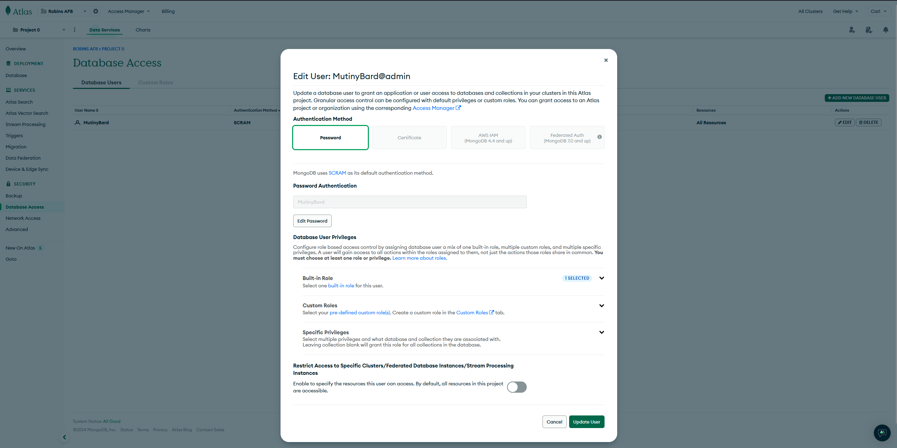
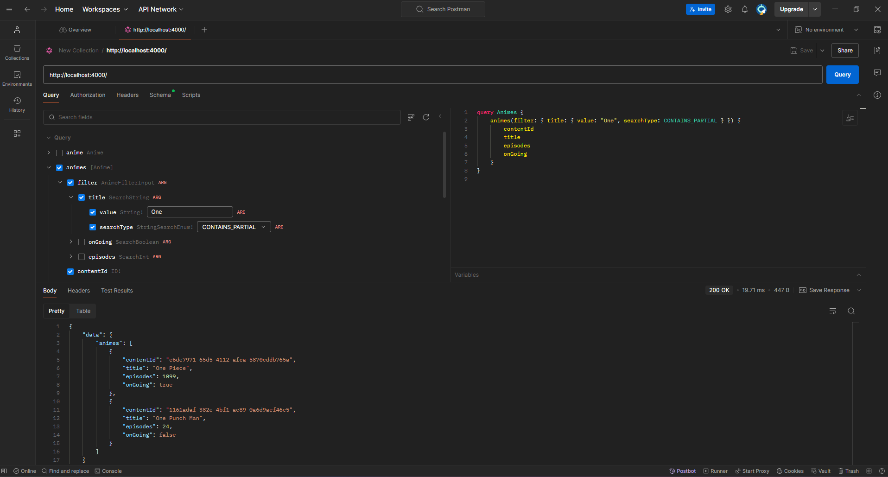

# GraphQL Boilerplate

A boilerplate project to get you started with GraphQL.

## Getting Started

### Installation

First, install the necessary dependencies:

```bash
npm install
```

### Set up env files
Create the following two files:
- local.env
- dev.env

Populate the contents structured as you see in example-dev.env within local.env and dev.env with real information:

MONGO_DB_PASS=fakePassword
MONGO_DB_USERNAME=fakePerson
MONGO_DB_DATABASE=fakeDatabase
MONGO_DB_HOSTNAME=fakedatabase.abcdefg.mongodb.net
MONGO_DB_OPTIONS=retryWrites=true&w=majority&appName=fakedatabase

Create an account and create a database here to build your own credentials:
https://account.mongodb.com/account/login

Find your uri:
https://www.mongodb.com/docs/guides/atlas/connection-string/

Create your password under the Database Access sidebar and click edit:


### Running

Run the application with the following

```bash
npm run local
```
or 
```bash
npm run dev
```

### Testing the API

You can test the GraphQL API using Postman or any other API client. After starting the server, you should be able to access the GraphQL Playground at the specified URL.



### Features

- Modularized schema and resolvers
- Create, Read, Update, Delete functionality
- Detailed Searching by value
- Express server setup
- Apollo Server integration
- MongoDB integration

### Summary for 5/29/2024
Create your schemas in the schemas folder, 
They then feed into the aggregated schema.js. 
Which is then used with apollo.js which creates a server.
The server is then used within src.js to launch your express server as a graphql app.

Next we will create more useful TypeDefs and Resolvers

### Summary for 9/8/2024
Able to use both Queries and Mutations (no db, not able to save)

### Summary for 9/9/2024
Able to effictively search per field, can create, update and delete mutations (has db, can save)

