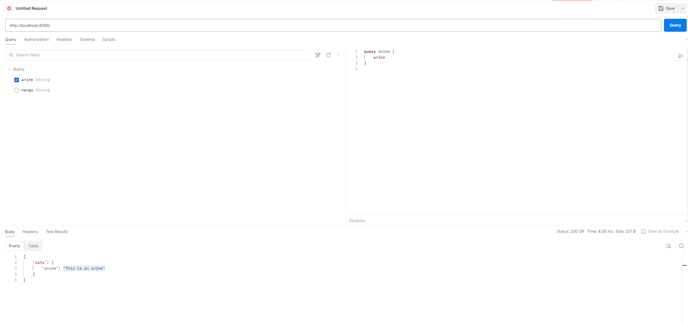

# GraphQL Boilerplate

A boilerplate project to get you started with GraphQL.

## Getting Started

### Installation

First, install the necessary dependencies:

```bash
npm install
```

### Running

Run the application with the following

```bash
npm start
```

### Testing the API

You can test the GraphQL API using Postman or any other API client. After starting the server, you should be able to access the GraphQL Playground at the specified URL.



### Features

- Modularized schema and resolvers
- Express server setup
- Apollo Server integration